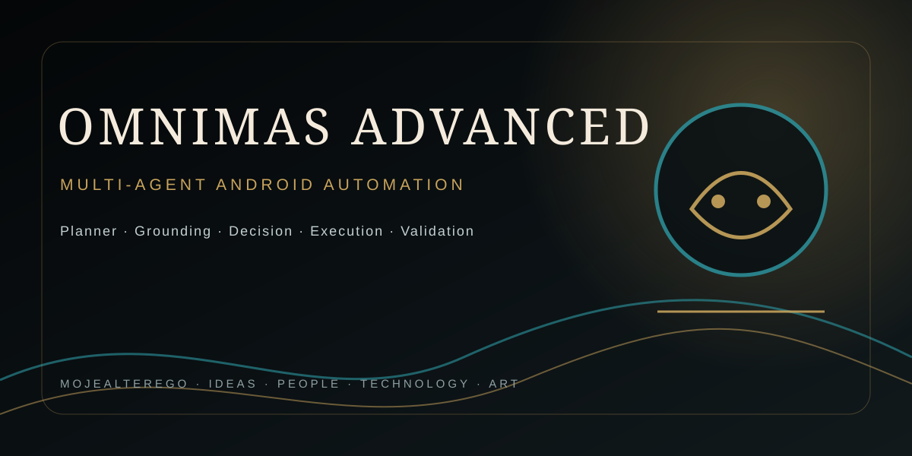

## MOJEALTEREGO · PROJECT PROFILE

---

# OmniMAS Advanced

Zaawansowany agent automatyzacji Android oparty o lokalny model LLM, Android AccessibilityService i pętlę Planner → Grounding → Decision → Execution → Validation.

## Architektura

- **Planner** — buduje plan misji z lokalnego Ollama.
- **Grounding** — odczytuje dostępne elementy aktywnego interfejsu przez AccessibilityService i tworzy fingerprint stanu.
- **Decision Agent** — wybiera pojedynczą następną akcję na podstawie misji, kroku, UI i pamięci.
- **Executor** — wykonuje CLICK, TYPE, SCROLL, BACK, HOME lub DONE.
- **Memory** — wykrywa powtarzające się stany i akcje.
- **Security Gate** — identyfikuje akcje wysokiego ryzyka i wymusza potwierdzenie użytkownika.
- **Supervisor** — waliduje zmianę stanu po akcji i przerywa kroki, które nie osiągają postępu.
- **Notification Memory** — lokalnie zapamiętuje ostatnie powiadomienia udostępnione przez system.

## Wymagania

- Android 9 / API 28 lub nowszy.
- Android Studio z obsługą Gradle wrappera projektu.
- Uruchomiony lokalny serwer Ollama dostępny dla aplikacji pod `http://127.0.0.1:11434`.
- Model zgodny z endpointem `/api/generate`; domyślnie `deepseek-r1:1.5b`.

> Uwaga: `127.0.0.1` oznacza urządzenie, na którym działa aplikacja. Telefon nie zobaczy przez to automatycznie Ollama działającego na innym komputerze. Dla zdalnego hosta należy zmienić endpoint i odpowiednio zabezpieczyć połączenie.

## Pierwsze uruchomienie

1. Zbuduj debug APK przez `./gradlew :app:assembleDebug` albo workflow GitHub Actions.
2. Zainstaluj APK na urządzeniu.
3. W aplikacji otwórz **Accessibility** i włącz usługę **OmniMAS Accessibility**.
4. W razie potrzeby włącz dostęp do powiadomień.
5. Uruchom Ollama i upewnij się, że model jest dostępny.
6. Wpisz misję i uruchom **START MAS**.

## Bezpieczeństwo

Automatyzacja przez AccessibilityService może oddziaływać na inne aplikacje. Projekt celowo rozdziela obserwację, decyzję i wykonanie. Operacje związane z zakupem, płatnością, transferem, wysyłką, publikacją lub usuwaniem danych są traktowane jako wysokiego ryzyka i wymagają jawnego potwierdzenia.

Nie przechowuj kluczy API ani innych sekretów w kodzie źródłowym lub repozytorium.

## CI

Workflow `.github/workflows/android.yml` buduje `:app:assembleDebug` na push/PR do `main` i publikuje `app-debug.apk` jako artifact.

## Status techniczny

To jest wersja bazowa zaawansowanej architektury. Do produkcyjnej automatyzacji warto następnie dodać trwałą bazę pamięci, testy instrumentacyjne, lepsze dopasowanie celu do node'ów, kolejkę misji, kontrolę timeoutów oraz bezpieczny transport do zdalnego LLM.
